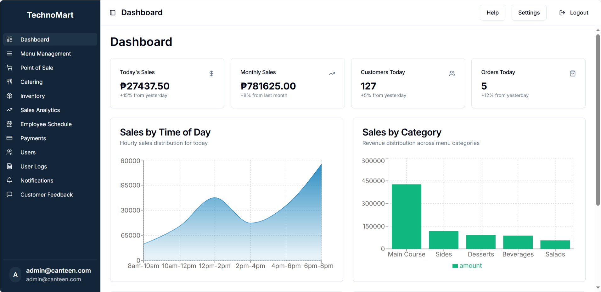

# Welcome

# 🍽️ Technomart Canteen Management System

An intelligent canteen ordering system built for the CTU-MC Multipurpose Cooperative. This platform digitizes food ordering, payment processing, inventory tracking, and user analytics — optimized for speed, accessibility, and usability across devices.

---

## 🧰 Tech Stack

- ⚡ **Vite** — Lightning-fast development server and bundler
- ⚛️ **React** — Component-based UI framework
- ✨ **TypeScript** — Type-safe JavaScript for scalability
- 🎨 **Tailwind CSS** — Utility-first CSS framework
- 🧩 **shadcn/ui** — Accessible, headless UI components

---

## 📸 Screenshots



---

## 🚀 Features

- ✅ Mobile-first design for ordering meals
- 💳 Supports cash, GCash, and other digital payments
- 📦 Inventory and supplier management
- 📈 Analytics dashboard for admins
- 🔐 Role-based access (Admin, Staff, Customer)
- 🛎️ Pre-ordering, order tracking, and real-time status updates

---

## 🛠️ Installation

```bash
# Clone the repo
git clone https://github.com/jsephandrade/technomart-canteen-management-system.git
cd technomart-canteen-management-system

# Install dependencies
npm install

# Run development server
npm run dev
```
